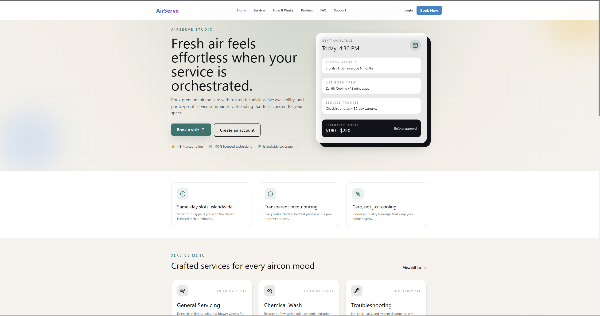

# AirServe — Customer Frontend

> **Next.js 14 · TypeScript · Tailwind CSS**
> Premium aircon servicing booking portal for Singapore customers.

---

## Table of Contents

1. [Tech Stack](#tech-stack)
2. [Quick Start](#quick-start)
3. [Database & Backend](#database--backend)
4. [Page Routing Reference](#page-routing-reference)
   - [Public Pages](#public-pages)
   - [Auth Pages](#auth-pages)
   - [Protected Pages](#protected-pages)
   - [Dynamic Routes](#dynamic-routes)
5. [Route Map (Diagram)](#route-map-diagram)
6. [API Integration](#api-integration)
7. [Demo Credentials](#demo-credentials)

---

## Tech Stack

| Layer | Technology |
|---|---|
| Framework | Next.js 14 (App Router) |
| Language | TypeScript |
| Styling | Tailwind CSS |
| State | Zustand |
| Forms | React Hook Form |
| HTTP | Axios |
| Animations | GSAP |
| Date Handling | date-fns |
| PDF Export | jsPDF + html2canvas |

---

## Quick Start

```bash
# 1. Make sure you are on the correct branch (source files live here)
git checkout dan-frontend-included

# 2. Navigate to the frontend directory
cd customer-frontend2

# 3. Install dependencies
npm install

# 4. Start the dev server
npm run dev
```

The app will be available at **http://localhost:3000**

> **Note:** The backend (Django) must be running at `http://127.0.0.1:8000` for live data.
> Without the backend, the app uses built-in mock data and a demo login account — no setup needed to view the UI.

---

## Database & Backend

### Primary Database

The backend (Django REST Framework) drives all persistent data.
The database used depends on the environment:

| Environment | Database | Location |
|---|---|---|
| **Local development** (default) | **SQLite 3** | `Integrated_Scheduling_System-master/appointment_scheduling/db.sqlite3` |
| **Production / staging** | **PostgreSQL** | Configured via `DB_ENGINE`, `DB_NAME`, `DB_HOST`, `DB_PORT` env vars |

The database is auto-selected in `settings.py`:

```python
# settings.py — simplified
if os.environ.get("DB_ENGINE"):
    DATABASES = { "default": { "ENGINE": "...", "NAME": "airserve_db", ... } }  # PostgreSQL
else:
    DATABASES = { "default": { "ENGINE": "django.db.backends.sqlite3", "NAME": BASE_DIR / "db.sqlite3" } }
```

### Django Models (Tables)

The following tables are created by `python manage.py migrate`:

| Model | Table | Description |
|---|---|---|
| `Customers` | `backend_api_customers` | Customer accounts — name, email, phone, address, password hash, ratings |
| `CustomerAirconDevices` | `backend_api_customeraircondevices` | Aircon units registered by a customer (brand, type, last service) |
| `Technicians` | `backend_api_technicians` | Technician accounts — location, status, specializations, rating |
| `TechnicianAvailability` | `backend_api_technicianavailability` | Per-technician weekly schedule and leave days |
| `Coordinators` | `backend_api_coordinators` | Staff/admin accounts that manage appointments |
| `Appointments` | `backend_api_appointments` | Bookings linking customer ↔ technician ↔ devices; stores status, times, payment |
| `AppointmentRating` | `backend_api_appointmentrating` | Post-service ratings (customer rates tech, tech rates customer) |
| `Messages` | `backend_api_messages` | Internal messaging between customers, coordinators, and technicians |
| `AirconCatalogs` | `backend_api_airconcatalogs` | Reference catalog of aircon brands and models |
| `TechnicianHiringApplication` | `backend_api_technicianhiringapplication` | 3-stage hiring workflow with documents, bank info, and coordinator approval |
| `TechnicianPasswordResetToken` | `backend_api_technicianpasswordresettoken` | Time-limited tokens for technician password reset |

### How the Frontend Connects to the DB

```
Browser (Next.js)  ──Axios──▶  Django REST API (port 8000)  ──ORM──▶  SQLite / PostgreSQL
```

The base URL is set in `lib/api.ts`:

```ts
const API_BASE_URL = process.env.NEXT_PUBLIC_API_URL || 'http://127.0.0.1:8000/api';
```

Override it by creating a `.env.local` file:

```env
NEXT_PUBLIC_API_URL=http://your-backend-host/api
```

### Running the Backend (Django)

```bash
# Navigate to the Django project
cd Integrated_Scheduling_System-master/appointment_scheduling

# Create and activate virtual environment
python -m venv venv
venv\Scripts\activate          # Windows
# source venv/bin/activate     # macOS / Linux

# Install Python dependencies
pip install -r requirements.txt

# Run database migrations (creates db.sqlite3 if it doesn't exist)
python manage.py migrate

# Seed test data (creates coordinators, technicians, customers, aircon catalog)
python create_test_users.py

# Start the Django backend server
python manage.py runserver
```

Backend will be available at **http://127.0.0.1:8000**

---

## Page Routing Reference

All pages use the **Next.js App Router**. Files live in `customer-frontend2/app/`.

---

### Public Pages

These pages are accessible without logging in.

---

#### `/` — Home / Landing Page

**File:** `app/page.tsx`



The main landing page for AirServe Studio. Designed to convert visitors into bookings.

**Sections on this page:**

| Section | Description |
|---|---|
| Hero | Headline, CTA buttons ("Book a visit", "Create an account"), service summary card with live next-available slot mock |
| Highlights | 3 USP cards — same-day slots, transparent pricing, air quality care |
| Service Menu | Preview of General Servicing, Chemical Wash, and Troubleshooting with prices |
| How It Works | 3-step booking flow explainer with live status mock panel |
| Reviews | Customer testimonials + 30-day warranty guarantee card |
| FAQ | Collapsible accordion with 5 common questions |
| CTA Footer Banner | "Pick a slot in under 60 seconds" with Book Now button |

**Key links from this page:**

| Button / Link | Navigates to |
|---|---|
| Book a visit | `/book` |
| Create an account | `/register` |
| View full service list | `/services` |
| Start booking (bottom banner) | `/book` |

---

#### `/services` — Services Catalog

**File:** `app/services/page.tsx`


Displays the full AirServe service catalog. Each service card links to its own detail page.

**Services listed:**

| Service ID | Service Name | Starting Price |
|---|---|---|
| `general` | General Servicing | $50 / unit |
| `chemical` | Chemical Wash | $80 / unit |
| `troubleshooting` | Troubleshooting & Repair | $60 / visit |
| `installation` | Installation | $150 flat |
| `gas-topup` | Gas Top-Up | $80 flat |

**Key links from this page:**

| Button | Navigates to |
|---|---|
| Learn More (per card) | `/services/[slug]` |
| Book Now (bottom CTA) | `/book` |

---

#### `/services/[slug]` — Service Detail Page

**File:** `app/services/[slug]/page.tsx`


Individual detail page for a specific service. The `[slug]` parameter maps to the service IDs in the table above.

**Valid slugs:**

```
/services/general
/services/chemical
/services/troubleshooting
/services/installation
/services/gas-topup
```

**Content on each service page:**

| Section | Description |
|---|---|
| Header | Icon, name, description, rating, and duration |
| Pricing | Starting price with per-unit or flat-rate breakdown |
| What's Included | Checklist of covered work |
| Not Included | Items excluded from this service |
| Duration & Warranty | Time estimate + warranty period card |
| FAQ | Service-specific collapsible Q&A |
| Book CTA | "Book This Service" button pre-fills `/book?service=[slug]` |

**Breadcrumb path:** `Home > Services > [Service Name]`

---

#### `/estimate` — Price Estimator

**File:** `app/estimate/page.tsx`


Interactive cost calculator. Lets users estimate their total before committing to a booking.

**Inputs:**

| Input | Description |
|---|---|
| Service Type | Select from the full services list |
| Number of Units | Stepper (1–20 units) |
| Add-ons | Optional extras (e.g., filter replacement, extended warranty) |
| Urgency | Normal or Priority Service (+$20) |

**Output:**
- Live price range displayed on the right panel (±10% variance shown)
- Breakdown of service cost, add-ons, and travel fee ($10)

**On "Continue to Booking":** Passes all selections as URL query params to `/book`:
```
/book?service=general&units=2&addons=filter&priority=true
```

---

#### `/support` — Help & Support

**File:** `app/support/page.tsx`


Customer support hub with self-service links, contact options, and FAQ.

**Sections:**

| Section | Description |
|---|---|
| Hero | Contact info (phone/email), "Send a message" and "Book a service" CTAs |
| Self-Service Cards | Quick links to Track Booking and Manage Bookings (both go to `/dashboard`) |
| FAQ | 8 collapsible questions covering bookings, pricing, warranty, cancellations |
| Service Promise | Response time, warranty, and availability info card |

**Contact modal:** Opens an inline form that collects Name, Email, Booking Reference (optional), and Message. Currently a UI mock — the submit button shows a success state without sending to an API.

---

### Auth Pages

These pages redirect to `/dashboard` if the user is already logged in.

---

#### `/login` — Sign In

**File:** `app/login/page.tsx`


Standard email + password login form.

**Behaviour:**

1. If credentials match the built-in demo account (`test@hotmail.com` / `123`), logs in with mock data immediately — **no backend required**.
2. Otherwise, calls `POST /api/customers/login` on the Django backend.
3. On success, stores customer data in Zustand store and redirects to `/dashboard`.

**Links on this page:**

| Link | Navigates to |
|---|---|
| Sign up | `/register` |

---

#### `/register` — Create Account

**File:** `app/register/page.tsx`


New customer registration form.

**Fields:**

| Field | Validation |
|---|---|
| Full Name | Required |
| Email Address | Required, valid email |
| Phone Number | Required, exactly 8 digits (Singapore) |
| Address | Required |
| Postal Code | Required, exactly 6 digits (Singapore) |
| Password | Required, min 6 characters |
| Confirm Password | Must match password |

**On submit:** Calls `POST /api/customers` then auto-logs in the new user and redirects to `/dashboard`.

**Links on this page:**

| Link | Navigates to |
|---|---|
| Sign in | `/login` |

---

### Protected Pages

These pages redirect to `/login` if the user is not authenticated.

---

#### `/dashboard` — My Bookings

**File:** `app/dashboard/page.tsx`


The main authenticated home for customers. Displays all appointments grouped by status.

**Tabs:**

| Tab | Appointment Statuses Shown |
|---|---|
| Upcoming | `1` (Pending), `2` (Confirmed) |
| Completed | `3` (Completed) |
| Cancelled | `4` (Cancelled) |

**Each appointment card shows:**
- Booking ID (first 8 chars of UUID, uppercased)
- Status badge
- Date/time, address, number of units, assigned technician (if any)
- "View Details" button → opens `BookingDetailsModal` overlay

**For demo/mock user:** Uses `mockAppointments` from `lib/mockData.ts` (no backend needed).
**For real users:** Calls `GET /api/appointments?customerId=[id]`.

**Key links:**
- "Book Appointment" empty state button → `/book`

---

#### `/book` — Book a Service (5-Step Wizard)

**File:** `app/book/page.tsx`


The main booking flow. Accepts query params pre-filled from `/estimate` or `/services/[slug]`.

**Query params accepted:**

| Param | Description |
|---|---|
| `service` | Pre-selects a service (e.g., `?service=general`) |
| `units` | Pre-sets number of units |
| `addons` | Pre-checks add-ons (repeatable) |
| `priority` | Sets urgency to priority if `true` |

**5 Steps:**

| Step | Name | Fields |
|---|---|---|
| 1 | Service | Service type selector, number of units stepper, optional add-ons |
| 2 | Address | Full address, postal code, optional notes |
| 3 | Schedule | Date picker (next 30 days, Mon–Sat), time slot grid |
| 4 | Contact | Full name, email, phone |
| 5 | Review | Order summary, payment method selector, total cost |

**On "Confirm Booking":**
1. Saves booking summary to `localStorage` as `lastBooking`
2. Attempts to create customer account and appointment via API (non-blocking — shows success regardless)
3. Redirects to `/booking-success`

---

#### `/booking-success` — Booking Confirmed

**File:** `app/booking-success/page.tsx`


Post-booking confirmation page. Reads booking summary from `localStorage`.

**Content:**

| Section | Description |
|---|---|
| Success header | Green checkmark, "Booking Confirmed!", booking ID |
| Invoice table | Line items for service, add-ons, travel fee, total |
| Appointment details | Date/time, address, number of units, payment method |
| Email notice | Confirms invoice sent to user's email |
| Download PDF | Opens a print-ready invoice in a new tab |

**Action buttons:**
- View Dashboard → `/dashboard`
- Back to Home → `/`

---

#### `/profile` — My Profile

**File:** `app/profile/page.tsx`


Full account hub with 4 tabbed sections.

**Tabs:**

| Tab | Content |
|---|---|
| Overview | Personal info (name, email, phone, address), service summary stats (total, completed, upcoming), quick action buttons |
| My Devices | List of registered aircon units with type, unit count, last service date, and remarks |
| Service History | All appointments sorted newest-first with status icons; links to individual booking pages |
| Messages | Inbox of messages from coordinators/technicians; unread count badge; "Mark as read" per message |

**Stats cards at top:**

| Card | Data |
|---|---|
| Total Appointments | Count of all appointments |
| Completed | Status `3` count (green) |
| Upcoming | Status `1` or `2` count (blue) |
| Aircon Devices | Number of registered devices |

**For demo user:** Uses `mockCustomer`, `mockAirconDevices`, `mockAppointments`, `mockMessages` from `lib/mockData.ts`.

---

### Dynamic Routes

---

#### `/bookings/[id]` — Booking Detail

**File:** `app/bookings/[id]/page.tsx`


Full detail view for a single appointment. Navigated to from the Dashboard or Profile → Service History.

**Content:**

| Section | Description |
|---|---|
| Header | Booking ID, status badge, Reschedule and Cancel buttons (if status allows) |
| Status Timeline | 6-step visual progress tracker: Requested → Confirmed → Assigned → On The Way → In Service → Completed |
| Schedule | Date, time window |
| Address | Customer address and postal code |
| Service Details | Unit count and device names |
| Payment | Payment method used |
| Technician Info | Name and phone (shown when assigned) |
| Cancellation Info | Reason and cancelled-by (shown when cancelled) |

**Cancel modal:** Inline modal that collects a cancellation reason before calling `PATCH /api/appointments/[id]`.

**Status code mapping:**

| Code | Label | Timeline Position |
|---|---|---|
| `1` | Pending / Requested | Step 0 |
| `2` | Confirmed | Step 1 (Step 2 if technician assigned) |
| `3` | Completed | Step 5 |
| `4` | Cancelled | Timeline hidden |

**Key links:**
- Reschedule → `/bookings/[id]/edit`
- Contact Support → `/support`
- Back → `/dashboard`

---

#### `/bookings/[id]/edit` — Reschedule Appointment

**File:** `app/bookings/[id]/edit/page.tsx`


Allows rescheduling an appointment to a new date and time.

**Rules:**
- Free reschedule available if appointment is **more than 24 hours away**
- If less than 24 hours, shows a notice directing the user to contact support

**Inputs (when reschedule is available):**
- Date picker (next 30 days, excludes Sundays)
- Time slot grid

**On confirm:** Calls `PATCH /api/appointments/[id]` with new `appointmentStartTime` and `appointmentEndTime`. Shows a success modal then redirects back to the booking detail page.

---

## Route Map (Diagram)

```
/                          Landing page (public)
├── /login                 Sign in
├── /register              Create account
├── /services              Services catalog
│   └── /services/[slug]   Service detail
│       slugs: general | chemical | troubleshooting | installation | gas-topup
├── /estimate              Price calculator
├── /support               Help & FAQ
│
├── /dashboard             My Bookings (auth required)
├── /book                  Booking wizard (auth optional)
├── /booking-success       Post-booking confirmation
├── /profile               Account hub (auth required)
└── /bookings/[id]         Booking detail (auth required)
    └── /bookings/[id]/edit  Reschedule (auth required)
```

---

## API Integration

All API calls are defined in `lib/api.ts` and grouped by resource:

| Export | Resource | Key Methods |
|---|---|---|
| `customerApi` | `/api/customers` | `login`, `register`, `getProfile`, `updateProfile` |
| `airconDeviceApi` | `/api/customeraircondevices` | `getDevices`, `createDevice`, `updateDevice`, `deleteDevice` |
| `appointmentApi` | `/api/appointments` | `getAppointments`, `getAppointment`, `createAppointment`, `updateAppointment`, `cancelAppointment` |
| `messageApi` | `/api/messages` | `getInbox`, `getSent`, `getUnreadCount`, `markAsRead`, `sendMessage` |

Authentication uses **JWT Bearer tokens** (managed by Django REST Framework SimpleJWT).

---

## Demo Credentials

The app works out-of-the-box with this built-in test account (no backend required):

| Field | Value |
|---|---|
| Email | `test@hotmail.com` |
| Password | `123` |

This account uses fully local mock data — appointments, devices, and messages are all pre-populated from `lib/mockData.ts`.

To test with a real account and live database, follow the [Running the Backend](#running-the-backend-django) steps and register a new account via `/register`.

---

## Adding README Images

To populate the image placeholders used in this document, take screenshots of each page and save them in:

```
customer-frontend2/docs/images/
```

Suggested filenames (matching the `` references above):

```
home.png
services.png
service-detail.png
estimate.png
support.png
login.png
register.png
dashboard.png
book-step1.png
book-step3.png
booking-success.png
profile.png
booking-detail.png
reschedule.png
```

Then the images will automatically appear inline in the README when viewed on GitHub or any Markdown renderer.
